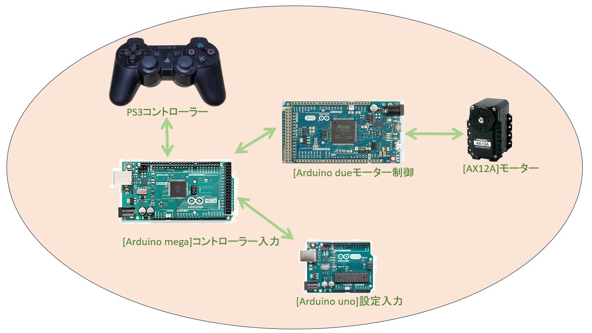

# RobotT1

PS3コントローラーによりロボットアームを操作することができるプロジェクトです。

# ブログ

[LCD編ブログ](https://tktomaru.hatenablog.jp/entry/2018/03/06/%E3%83%AD%E3%83%9C%E3%83%83%E3%83%88%E3%82%A2%E3%83%BC%E3%83%A0%E4%BD%9C%E6%88%90%E8%A8%98%E9%8C%B2%EF%BC%88LCD%E3%81%B8%E3%81%AE%E7%8A%B6%E6%85%8B%E8%A1%A8%E7%A4%BA%E7%B7%A8%EF%BC%89)

[制御編ブログ]https://tktomaru.hatenablog.jp/entry/2018/03/11/%E3%83%AD%E3%83%9C%E3%83%83%E3%83%88%E3%82%A2%E3%83%BC%E3%83%A0%E4%BD%9C%E6%88%90%E8%A8%98%E9%8C%B2%EF%BC%88%E3%83%AD%E3%83%9C%E3%83%83%E3%83%88%E3%82%A2%E3%83%BC%E3%83%A0%E5%88%B6%E5%BE%A1%E7%B7%A8

[設定編ブログ](https://tktomaru.hatenablog.jp/entry/2018/03/11/%E3%83%AD%E3%83%9C%E3%83%83%E3%83%88%E3%82%A2%E3%83%BC%E3%83%A0%E4%BD%9C%E6%88%90%E8%A8%98%E9%8C%B2%EF%BC%88%E8%A8%AD%E5%AE%9A%E7%B7%A8%EF%BC%89)

